# Welcome to Alexa Hackathon Runbook

  

  ## Pre-requisites before joining the hackathon

  - Each team should register to Alexa Developer Console:
    - Go to: https://developer.amazon.com/alexa
    - Click on "Create a skill"
  - For testing Alexa Skills, each team need any of the following:
    - A BYOD Alexa Device. If they choose this option, they should register the Alexa device using the same amazon account they used when registering to developer.amazon.com.
    - A web browser that supports Audio Inputs (ie. chrome)
      - They can use the Alexa Developer Console Tester
      - or use [https://echosim.io](https://echosim.io/). Just register using the same amazon account they used when registering to developer.amazon.com.
  - Each team should have a unique skill name to prevent accidental Alexa Start Session trigger.
  - Each team will be provided their own AWS Account to use.
  - We will be using the **[Cloud9](https://aws.amazon.com/cloud9/)** as our IDE and **[SAM (Serverless Application Model)](https://aws.amazon.com/serverless/sam/)** to provision and deploy our AWS resources.
  - We will be using **N. Virginia (us-east-1)** region for this hackathon. Always make sure that you are in this region when interacting with the AWS console, CLI, or SDK.
  - Each team should be able program using any of these languages: Node.js, Java, Python, C#, or Go. The sample skills and scaffolding code provided are written in **Python**.

  

  ## Hackathon Rules

  * The theme of this hackathon is "Building Productivity Alexa skills". This could be something like:
  
    * Meeting of the Minutes skill
    * Meeting room booking skill
    * A skill that voice back sales stats
  
  * While planning what skill to develop, make sure that you can deliver it within 3 hours.
  
  * Each team is allowed to use any other AWS services such as DynamoDB. This will give you extra points.
  
  * You can use any other third party API's. **PROTIP:** see if there's any interesting API's to play with in https://rapidapi.com/

  

## Setting up your Environment

- Once logged in to AWS console. Go to Cloud9 dashboard and create a new Environment with the following configuration. Make sure that you're in N.Virginia (us-east-1) region:
    - **Name:** Any
    - **Environment Type:** Create a new instance for environment (EC2)
    - **Instance type**: t2.micro (1 GiB RAM + 1 vCPU)
  - **Platform:** Amazon Linux
    - **Cost-saving setting**: 30 minutes
  - **Network VPC:** will be provided
    - **Subnet:** will be provided
- Click **Create Environment** and wait for the Cloud9 instance to boot up.
  - In Cloud9 IDE Terminal window, clone the hackathon materials
  - `$ git clone https://github.com/adelagon/alexa-hackathon-runbook.git`
  - We will be discussing how to build your own Alexa Skills on the section.

  
  
## Alexa Interaction Model

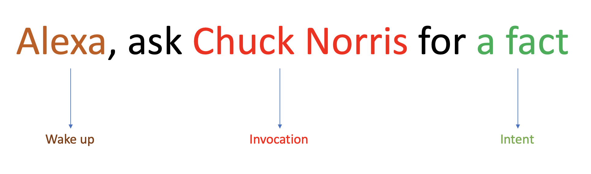

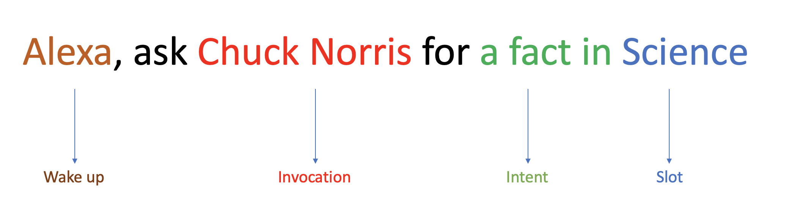

## How to write your own Alexa Skills

- In Cloud9 IDE, go to python samples folder and open the **app.py** file that contains the alexa skill written in python.
  
    - `$ cd alexa-hackathon-runbook/samples/python/alexa-random-chuck-fact/src`
- The provided example is a custom Alexa skill that give random Chuck Norris facts. At this point, we will spend some time to run through the well-documented code. This should give everyone an idea on how to write your own skill.
  

  
## How to Deploy the sample Alexa Skill

1. Focus on the Cloud9 Terminal Window and follow the next steps. Install dependencies:
  
   - `$ cd /home/ec2-user/environment/alexa-hackathon-runbook/samples/python/alexa-random-chuck-fact/src`
   - `$ pip-3.6 install -r requirements.txt -t .`
  
2. Create an S3 bucket for deployment:

   - `$ aws s3 mb s3://ph-alexa-hackathon-<team name>`

3. Create a lambda deployment package:

   - `$ sam package --output-template-file packaged.yaml --s3-bucket ph-alexa-hackathon-<team name>`

4. Deploy the Application:

   - `sam deploy --template-file packaged.yaml --stack-name alexa-random-chuck-fact-py --capabilities CAPABILITY_IAM`

5. Go to AWS Lambda Dashboard and look for the Function named **alexa-random-chuck-fact-***.

   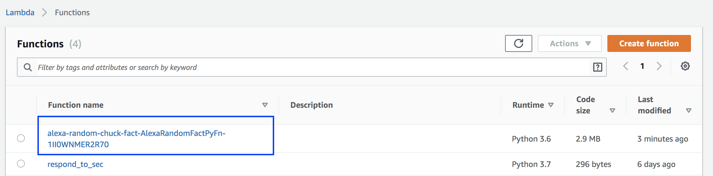

6. Copy the ARN of the Lambda function that was produced. This can be found on the Top Right corner of the Function detai page.

   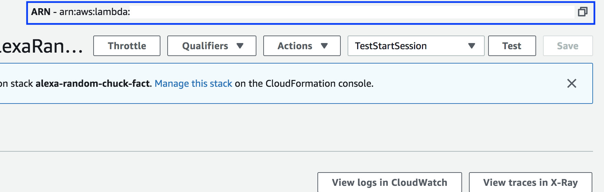

7. Login to https://developer.amazon.com/alexa and create a new skill. Put any value to the skill name and select "Custom" on Choose a model option and "Provision your own" on Choose a method to host as seen below then click "Create Skill":

   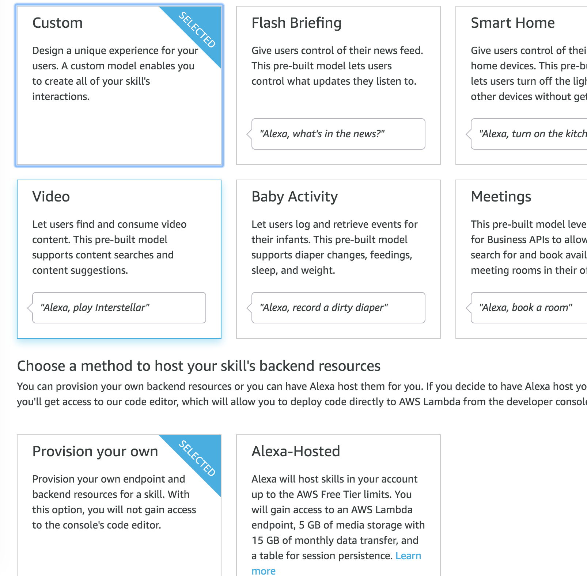

8. Choose "Start from Scratch" when choosing a template. Then click "Choose".

   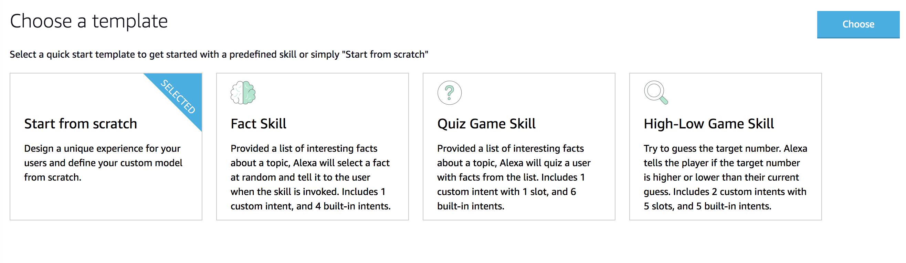

9. On the right side panel of the Alexa Developer Console. Click "1. Invocation Name" to specify the utterance that will trigger the Alexa Skill.

   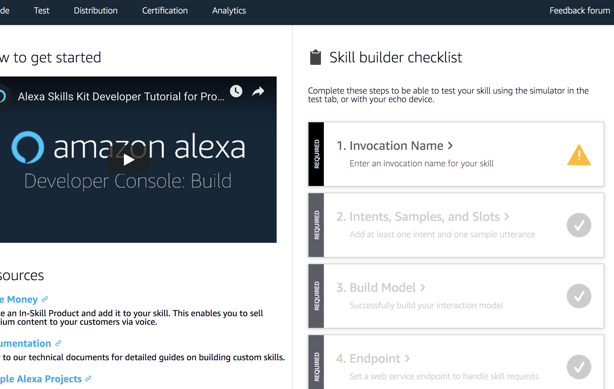

10. Enter the Skill Invocation Name. (ie. chuck norris). It could be any value. This will trigger the `LaunchRequestHandler`. Click "Save Model"

   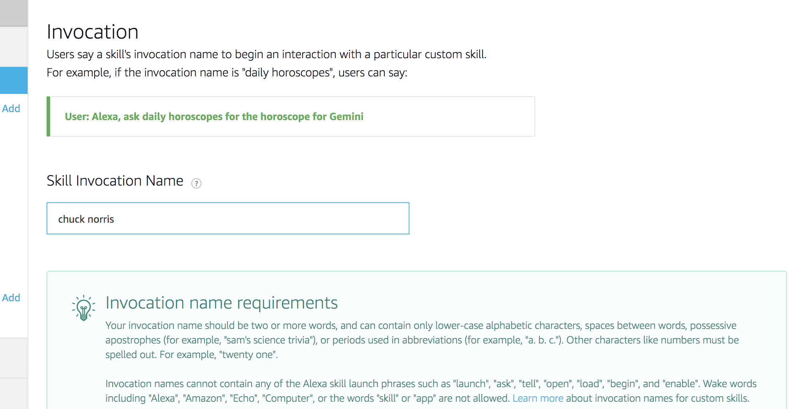

11. Now let's Add our Custom Intents. On the Left Panel. Click the '+ Add' Button right beside Intents:

    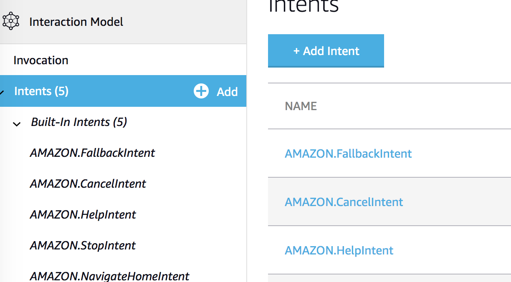

12. Type **AChuckFact** in Create custom intent. Then click "Create custom intent"

    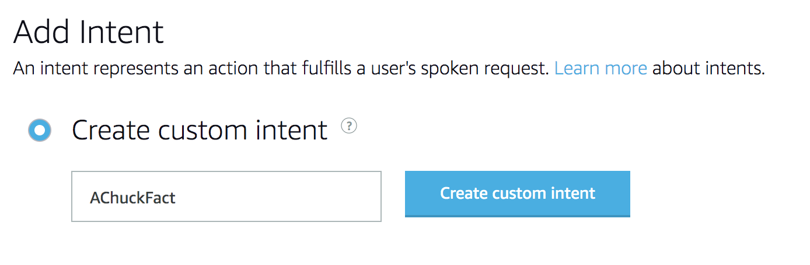

13. Now add Sample Utterance as **'a random fact'**. This will trigger the skill to provide another fact which is implemented in the `RandomFactHandler`.

    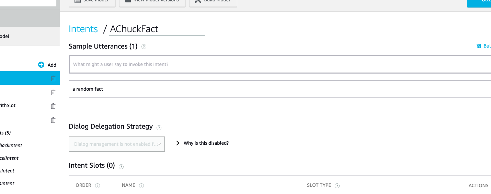

14. Now let's add  Slots. Click "+" beside the "Slot Types" on the left panel. Name the Custom slot type as **categories**. Then add two slot values: **science** and **music**.

    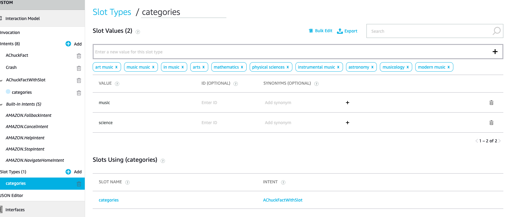

15. Add another Custom Intent named **'AChuckFactWithSlot'** and use the Slots we have created in Step 14. The utterance should be **'a {categories} fact'**, using that kind of utterance links the Slots to this Custom Intent. This custom intent triggers the `RandomFactWithCategoryHandler`

    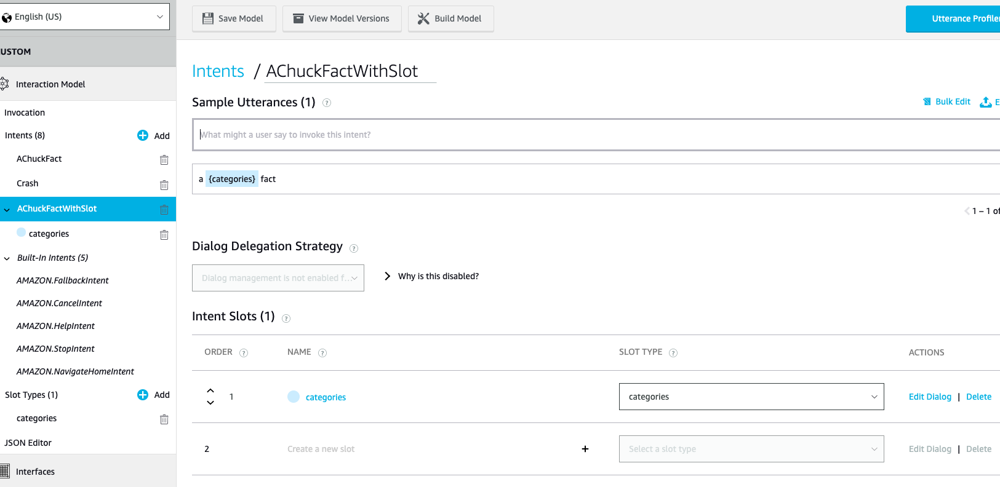

16. Add another Custom Intent named **'Crash'**.

    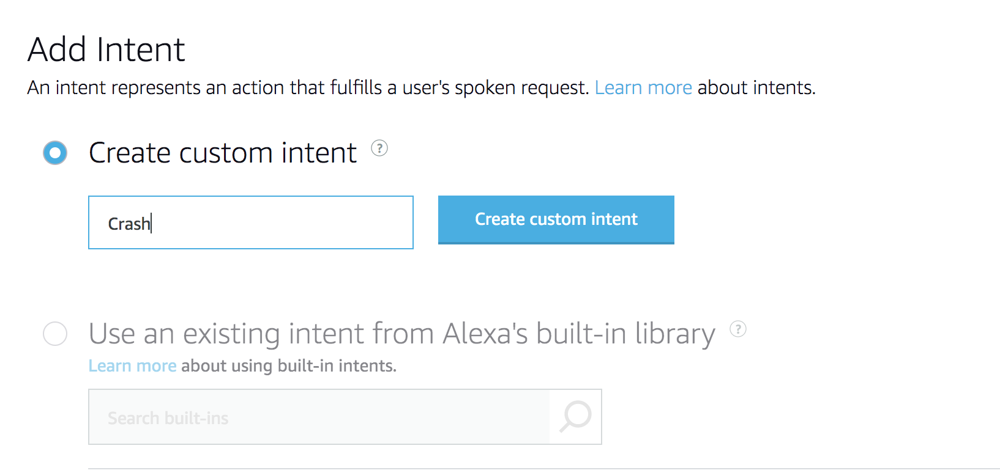

17. Now add Sample Utterances like: 'crash'. This will trigger the skill to simulate a skill bug in the `CrashHandler` which will then trigger the `AllExceptionHandler`.

    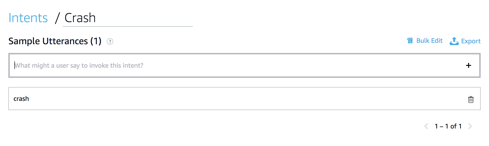

18. Now let's add the Utterances for the built-in AMAZON.HelpIntent. You can use 'help' and 'help me'. This will trigger the `HelpIntentHandler`

    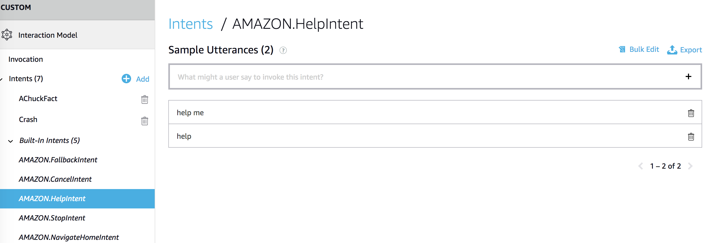

19. Add the Utterances for the built-in AMAZON.StopIntent. You can use 'stop' and 'goodbye'. This will trigger the `StopIntentHandler` 

    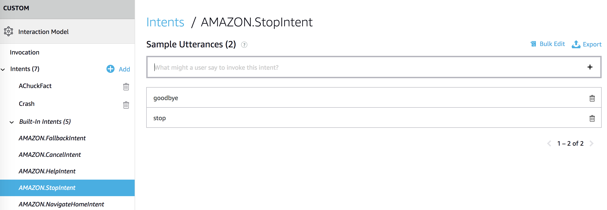

20. Copy the Skill ID. We'll use this on the next steps.

    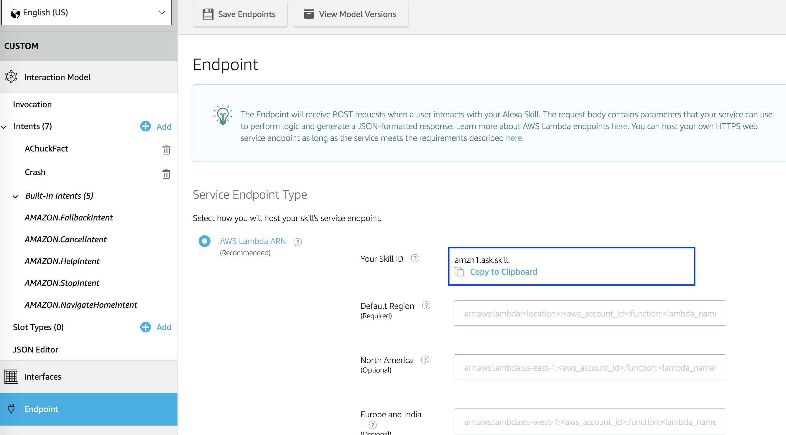

21. Go back to AWS Lambda dashboard and select the Lambda function named: **alexa-random-chuck-fact-*** that was created when you did Step 5. Click "Add Trigger" on the Configuration page.

    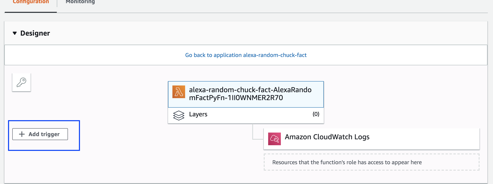

22. Select "Alexa Skill Kit" from the drop down of available lambda triggers.

    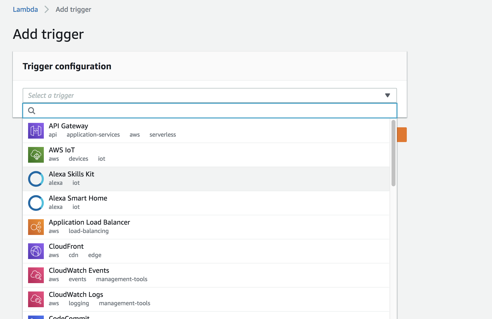

23. Provide the Alexa Skill ID that you have collected in Step 20. Then click Add.

    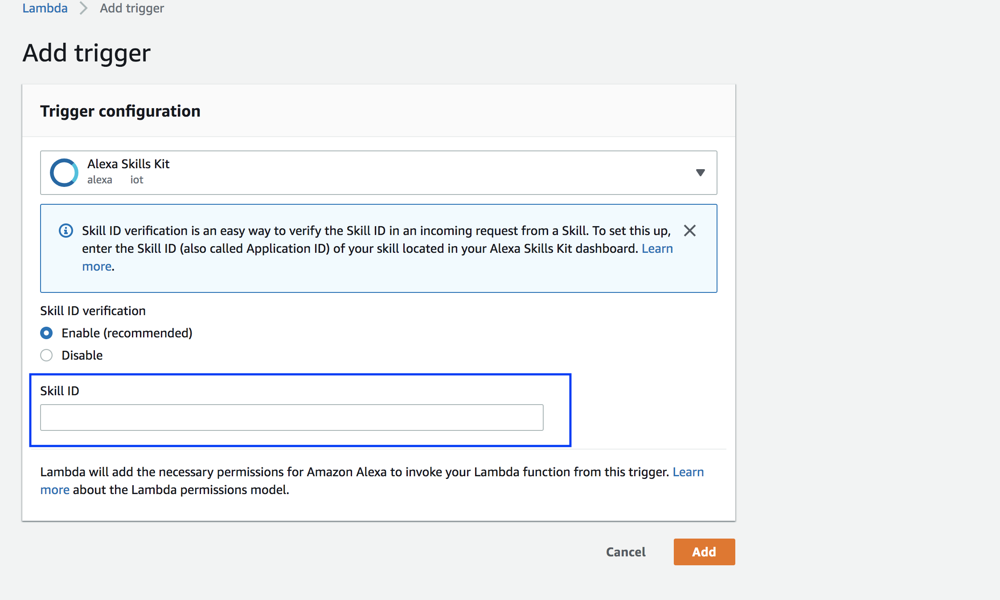

24. Go back to the Alexa Developer Dashboard and click on the "Endpoint" option on the left panel. Provide the Lambda ARN that you have obtained in Step 6 in the Default Region. Then Click "Save Endpoints"

    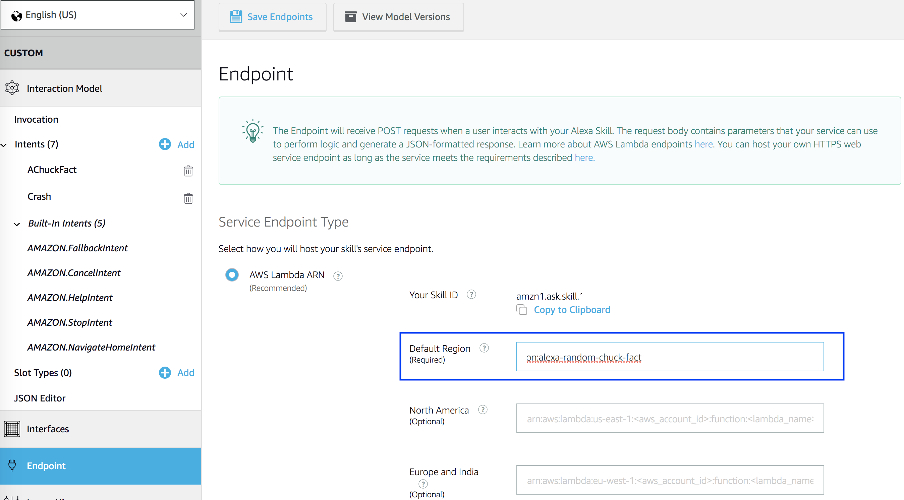

25. The Alexa Skill Checklist should look like this. 

    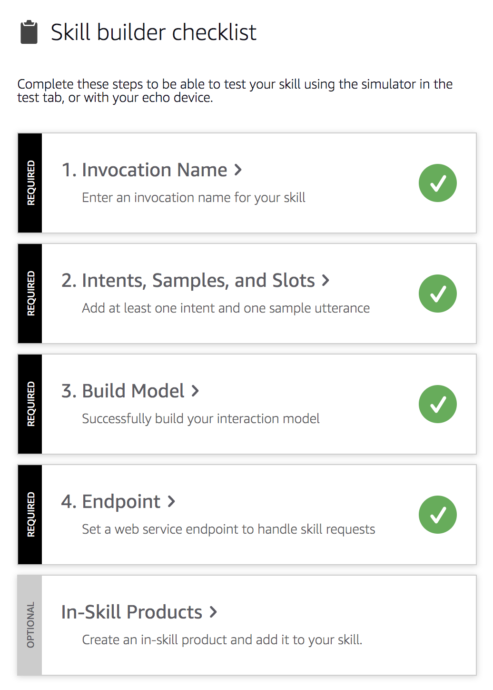

26. You may now test your Alexa skill. Try the following conversations:

    * *"Alexa ask Chuck Norris a random fact"*
    * *"Alexa ask Chuck Norris a music fact"*
    * Try saying *"Crash"* or *"a science fact"* or *"help me"* or *"goodbye"* during your dialogue with Alexa

## Tips

* Whenever you change anything on your code, use **sam package** to package it and **sam deploy** deploy to AWS:
  * `sam package --output-template-file packaged.yaml --s3-bucket ph-alexa-hackathon-<team name>`
  * `sam deploy --template-file packaged.yaml --stack-name <stack_name> --capabilities CAPABILITY_IAM`
* You can install any third party library. In python you can do this by adding an entry on **requirements.txt** file and running `pip-3.6 install -r requirements.txt -t .` within the **src** folder. Be sure to repackage and redeploy when you are doing this.
* For faster testing, you can use can configure Lambda Test Events using the **Amazon Alexa** event templates.
* Use AWS Cloudwatch to see the lambda logs.
* Have multiple tabs open on your web browser for both AWS console and Alexa Developer console. Better yet, split tasks amongst each team member.
* Use a good invocation name. The one that is easy to pronounce.

## Resources

* Alexa Skills Kit - https://developer.amazon.com/en-US/alexa/alexa-skills-kit/learn
* Bult-in Intents List - https://developer.amazon.com/docs/custom-skills/implement-the-built-in-intents.html
* ASK SDK for python docs - https://alexa-skills-kit-python-sdk.readthedocs.io/en/latest/
* ASK SDK for node.js docs - https://ask-sdk-for-nodejs.readthedocs.io/en/latest/
* ASK SDK for java docs - https://github.com/alexa/alexa-skills-kit-sdk-for-java
* AWS SAM - https://aws.amazon.com/serverless/sam/
* AWS Cloud9 docs - https://docs.aws.amazon.com/cloud9/latest/user-guide/welcome.html
